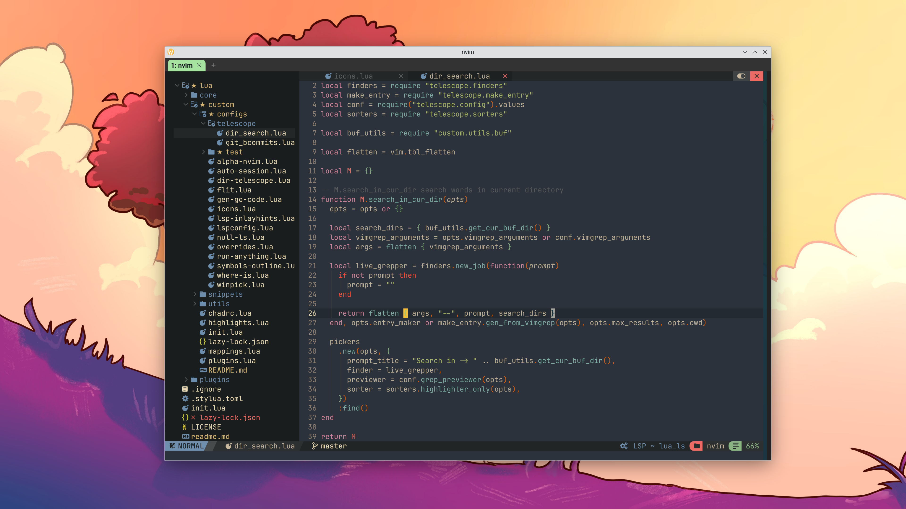

Use [NvChad](https://github.com/NvChad/NvChad) and change it.

# Mood

>I need a new repo because it always breaks after I upgrade to the latest NVChad. It hurts me. (023.9.3)

>Ok, I admit that I love neovim and NvChad! (024.4.3)


# Screenshot


# Install

```bash
git clone git@github.com:youguanxinqing/nvim.git ~/.config/nvim && nvim
```

# Dependencies

## Personal

Under command line mode, `UploadFile` can upload your file to specified remote server. It needs `sync-client` on your local OS and `sync-server` on your remote OS. See: https://github.com/youguanxinqing/sync-file

## Community

`ripgrep`: https://github.com/BurntSushi/ripgrep

`fd`: https://github.com/sharkdp/fd
